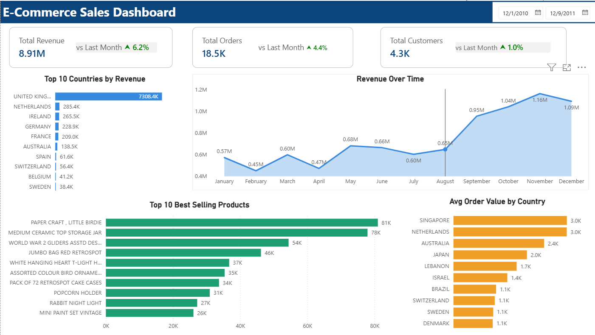

# E-Commerce Analytics Pipeline & Dashboard

A production-ready end-to-end data project — from raw data to a live Power BI dashboard. Built with Python, PostgreSQL, and Power BI.



---

## What This Project Does

Raw e-commerce data goes through a complete analytics pipeline:

```
Raw CSV Data
    → ETL Pipeline (Python)
        → PostgreSQL Database
            → Power BI Dashboard
```

1. **Extracts** raw e-commerce data from PostgreSQL
2. **Cleans** it — removes duplicates, standardizes columns, fills missing values
3. **Validates** data quality and generates a report
4. **Calculates KPIs** — Revenue, Orders, Customers, AOV
5. **Visualizes** everything in an interactive Power BI dashboard

---

## Dashboard Preview


The Power BI dashboard includes:

- **KPI Cards** — Total Revenue (£8.91M), Total Orders (18.5K), Total Customers (4.3K) with Month-over-Month % change
- **Revenue Over Time** — Monthly trend from Dec 2010 to Dec 2011
- **Top 10 Countries by Revenue** — United Kingdom dominates at £7.3M
- **Top 10 Best Selling Products** — by quantity sold
- **Average Order Value by Country** — Singapore and Netherlands lead at £3.0K

---

## Project Structure

```
ecommerce-automation-project/
├── etl_pipeline.py          # Main ETL pipeline
├── test_etl.py              # Unit tests (21 tests)
├── .env.example             # Environment variable template
├── .gitignore               # Ignores .env, exports, logs
├── requirements.txt         # Python dependencies
├── assets/
│   └── dashboard.png        # Dashboard screenshot
├── exports/                 # Auto-created on run
│   ├── cleaned_data_YYYYMMDD_HHMMSS.csv
│   └── data_report_YYYYMMDD_HHMMSS.txt
└── etl_log.log              # Auto-created on run
```

---

## Tech Stack

| Tool | Purpose |
|------|---------|
| Python 3.12 | Core pipeline language |
| Pandas | Data cleaning and transformation |
| Psycopg2 | PostgreSQL connection pooling |
| python-dotenv | Secure credential management |
| pytest | Unit testing (21 tests) |
| PostgreSQL | Data storage |
| Power BI | Interactive dashboard |

---

## Setup & Installation

### 1. Clone the repository

```bash
git clone https://github.com/codewithpatil-droid/ecommerce-automation-project.git
cd ecommerce-automation-project
```

### 2. Install dependencies

```bash
pip install -r requirements.txt
```

### 3. Configure environment variables

```bash
cp .env.example .env
```

Edit `.env` with your database credentials:

```env
DB_NAME=ecomdb
DB_USER=postgres
DB_PASSWORD=your_password_here
DB_HOST=localhost
DB_PORT=5433
```

> Never commit your `.env` file. It is already listed in `.gitignore`.

### 4. Run the pipeline

```bash
python etl_pipeline.py
```

### 5. Run the tests

```bash
pytest test_etl.py -v
```

Expected output:
```
21 passed, 0 failed in Xs
```

---

## Pipeline Output

**Console log:**
```
2024-01-15 10:30:00 - INFO - ETL PIPELINE STARTED
2024-01-15 10:30:01 - INFO - Data fetched successfully: 397,880 rows, 8 columns
2024-01-15 10:30:01 - INFO - Removed 5,268 duplicate rows
2024-01-15 10:30:02 - INFO - KPI calculation completed: 5 KPIs calculated
2024-01-15 10:30:02 - INFO - Cleaned data saved: exports/cleaned_data_20240115.csv
2024-01-15 10:30:02 - INFO - ETL PIPELINE COMPLETED SUCCESSFULLY
```

**KPI Report sample:**
```
============================================================
BUSINESS KPIs
============================================================
Total Revenue:         8911407.90
Total Orders:          18532
Total Customers:       4338
Average Order Value:   481.12
Top Country:           United Kingdom
```

---

## Configuration Reference

| Variable | Default |             | Description              |
|----------|---------|-------------|
| `DB_NAME` | `Your database name` | PostgreSQL database name |
| `DB_USER` | `postgres`           | Database username        |
| `DB_PASSWORD` | `your password`  | Database password        |
| `DB_HOST` | `localhost`          | Database host            |
| `DB_PORT` | `5433`               | Database port            |

---

## Dataset

Source: [UCI Online Retail Dataset]
Period: December 2010 — December 2011
Records: 397,880 transactions
Region: UK-based e-commerce retailer

---

## Author

Built by [Babasaheb Patil] · [babasahebpatil271@gmail.com] · [LinkedIn -www.linkedin.com/in/babasaheb-patil-5004aa36a

] · [GitHub-https://github.com/codewithpatil-droid]